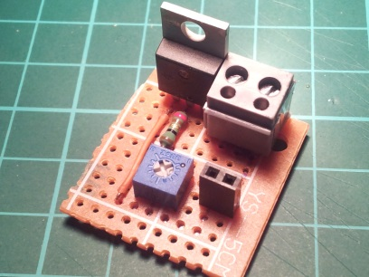
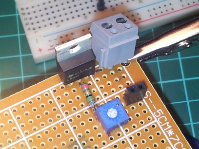
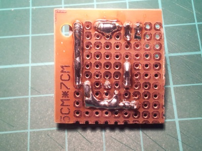
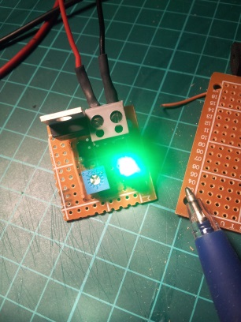
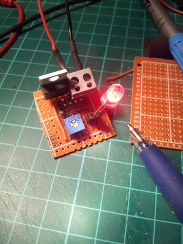

LEd Tester
===========

*Led tester - v0.1*

Specifications
---------------

This led Tester accept on input from 1.25V to 37V (LM317 limitation).
The current through the LED from 10mA to 80mA (adjustable with 100 Ohms portentiometer).

Documentation
--------------

+ [Schema](doc/schema.md)
+ [Bom](doc/bom.md)

Images
-------

License Information
-------------------
All this work is under [MIT license](http://en.wikipedia.org/wiki/MIT_License)
